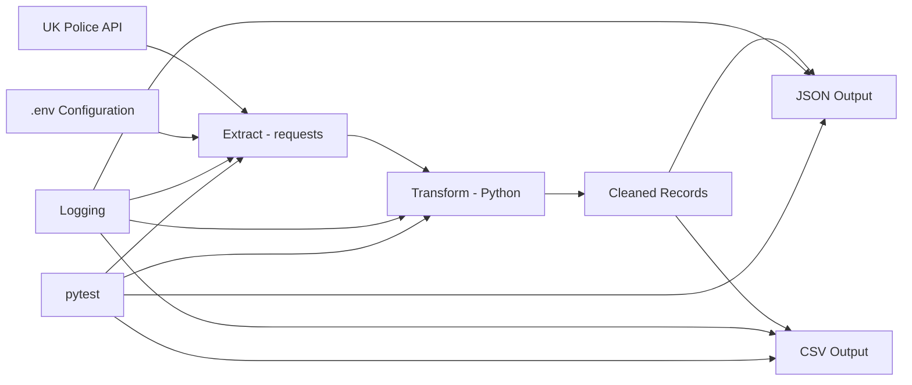

# UK Crime Data Pipeline

An end-to-end Python data engineering project that extracts street-level crime data from the UK Police API, cleans and validates the records, saves the results as JSON and CSV, and runs consistently inside Docker.

This project is being developed as a portfolio project to demonstrate practical data engineering skills including API ingestion, data transformation, error handling, logging, automated testing, Git/GitHub, Docker, and later cloud deployment with Google Cloud Platform.

## Architecture



Current local pipeline:

```text
UK Police API
      ↓
extract.py
      ↓
Raw JSON response
      ↓
transform.py
      ↓
Cleaned Python records
      ↓
load.py
   ↙       ↘
JSON       CSV
```

The pipeline can also run inside Docker, with the output directory bind-mounted back to the host machine.

## Features

- Extracts crime data from the UK Police API
- Uses query parameters for date and coordinates
- Handles HTTP errors, timeouts, and connection errors
- Converts latitude and longitude values to numeric types
- Handles missing, invalid, or incomplete location data safely
- Separates extraction, transformation, loading, and orchestration into modules
- Uses environment variables for configuration
- Logs pipeline activity and failures
- Saves cleaned data as JSON and CSV
- Includes automated unit tests with `pytest`
- Uses mocks to test API behaviour without calling the real API
- Uses temporary files to test JSON and CSV output safely
- Runs inside a Docker container
- Supports bind mounts so generated files persist outside the container

## Project Structure

```text
crime_pipeline/
│
├── main.py
├── extract.py
├── transform.py
├── load.py
│
├── requirements.txt
├── Dockerfile
├── .dockerignore
├── .gitignore
├── .env.example
│
├── tests/
│   ├── test_extract.py
│   ├── test_transform.py
│   ├── test_load.py
│   └── test_main.py
│
├── data/
│   ├── cleaned_crime_data.json
│   └── cleaned_crime_data.csv
│
└── logs/
    └── crime_pipeline.log
```

Generated data files, logs, local virtual environments, caches, and the real `.env` file are excluded from version control.

## Technologies Used

- Python 3.13
- `requests`
- `python-dotenv`
- `pytest`
- Python `logging`
- JSON
- CSV
- Docker
- Git
- GitHub

## Configuration

Create a local `.env` file using `.env.example` as the template.

Example:

```env
POLICE_API_URL=https://data.police.uk/api/crimes-street/all-crime
CRIME_DATE=2026-01
LATITUDE=52.629729
LONGITUDE=-1.131592
```

The real `.env` file should not be committed to GitHub.

## Running Locally

### 1. Clone the repository

```bash
git clone https://github.com/Rohit-Roby/uk-crime-data-pipeline.git
cd uk-crime-data-pipeline
```

### 2. Create and activate a virtual environment

Windows PowerShell:

```powershell
python -m venv .venv
.\.venv\Scripts\Activate.ps1
```

macOS/Linux:

```bash
python -m venv .venv
source .venv/bin/activate
```

### 3. Install dependencies

```bash
pip install -r requirements.txt
```

### 4. Create `.env`

Copy `.env.example` to `.env` and enter the configuration values you want to use.

### 5. Run the pipeline

```bash
python main.py
```

If successful, the pipeline will:

1. Fetch crime data from the UK Police API
2. Clean and validate the records
3. Save the cleaned data to JSON
4. Save the cleaned data to CSV
5. Write pipeline logs

## Running Tests

Run all tests with:

```bash
python -m pytest -v
```

The current test suite covers:

- Successful API requests
- API timeouts
- HTTP errors
- Connection errors
- Valid crime records
- Invalid coordinates
- Missing location data
- Empty records
- Mixed record batches
- JSON output
- CSV output
- Empty output handling
- Successful pipeline orchestration
- No-data pipeline behaviour

At the current stage of the project, the suite contains **14 automated tests**.

## Running with Docker

### Build the image

```bash
docker build -t uk-crime-pipeline .
```

### Run the pipeline in Docker

```bash
docker run --rm --env-file .env uk-crime-pipeline
```

### Run with persistent output

PowerShell:

```powershell
docker run --rm --env-file .env -v "${PWD}/data:/app/data" uk-crime-pipeline
```

This maps the container's `/app/data` directory to the local `data` directory.

## Example Pipeline Logs

```text
INFO | __main__  | Pipeline started
INFO | extract   | Sending request to Police API
INFO | extract   | Successfully fetched records from Police API
INFO | transform | Successfully cleaned records
INFO | load      | Data successfully saved to JSON
INFO | load      | Data successfully saved to CSV
INFO | __main__  | Pipeline completed successfully
```

## Data Transformation

The transformation layer converts raw API records into a simpler analytical structure.

Example cleaned record:

```json
{
  "id": 116208788,
  "category": "anti-social-behaviour",
  "latitude": 52.627703,
  "longitude": -1.12303,
  "street": "On or near The Oval",
  "month": "2024-01"
}
```

Invalid or unavailable coordinate values are converted to `null`/`None` rather than crashing the pipeline.

## Error Handling

The extraction layer handles common request failures such as:

- Timeouts
- HTTP errors
- Connection failures
- Other `requests` exceptions

The transformation layer safely handles:

- Missing keys
- `None` values
- Invalid numeric values
- Missing nested location data

## Testing Approach

The project uses unit tests to isolate each part of the pipeline.

External HTTP calls are mocked so tests remain fast and predictable:

```text
Real application:
fetch_crime_data() → requests.get() → Police API

Unit test:
fetch_crime_data() → mocked requests.get() → controlled response
```

File output tests use pytest's `tmp_path` fixture so tests do not pollute the real project data directory.

## Current Status

Completed:

- Python pipeline fundamentals
- API ingestion
- JSON handling
- Data cleaning
- Error handling
- Modular project structure
- Environment variables
- Logging
- Automated testing with pytest
- Git and GitHub
- Docker containerisation
- Persistent Docker output using bind mounts

## Roadmap

Planned next stages:

- Google Cloud Platform fundamentals
- Google Cloud Storage raw landing zone
- BigQuery warehouse
- Cloud-based loading
- dbt transformations and data-quality tests
- Scheduling/orchestration
- CI/CD
- Dashboard/analytics layer
- Optional AI/RAG extension

Target architecture:

```text
UK Police API
      ↓
Python / Docker
      ↓
Google Cloud Storage
      ↓
BigQuery
      ↓
dbt
      ↓
Clean analytical models
      ↓
Dashboard / AI applications
```

## Purpose

The purpose of this project is to demonstrate practical data engineering skills through a complete, progressively productionised pipeline rather than a notebook-only academic exercise.

The project focuses on:

- Automation
- Reliability
- Data quality
- Modular software design
- Testing
- Observability
- Containerisation
- Cloud-ready architecture

## Author

Rohit Roby
